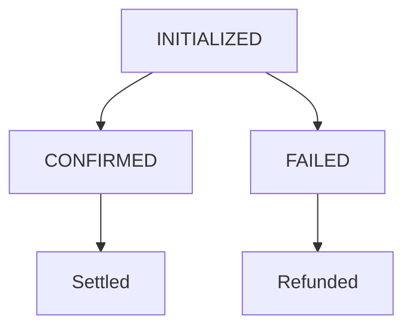

# Payments

Payments are the core of Orafi's functionality. This guide explains the payment lifecycle, status transitions, and how to handle payments effectively.

## Payment Lifecycle

A payment goes through several states from creation to completion:

1. **INITIALIZED**: Payment created, waiting for customer to send crypto
2. **CONFIRMED**: Transaction confirmed on blockchain
3. **FAILED**: Payment failed or expired

## Status Transitions



## Expiration & Confirmation

- **Expiration**: Payments expire after 24 hours if not completed
- **Confirmation**: Requires 1 blockchain confirmation for most networks
- **Irreversible**: Confirmed payments cannot be reversed

## Fees & Settlement

- **Transaction fees**: Network fees are deducted from the payment amount
- **Settlement**: Funds are settled to your configured accounts
- **Currency**: All amounts in USDC equivalent

## Creating Payments

### Hosted Checkout

For full payment pages hosted by Orafi:

```javascript
const payment = await fetch('/transactions/payment/hosted/create', {
  method: 'POST',
  headers: {
    'Content-Type': 'application/json',
    'x-api-key': process.env.ORAFI_API_KEY
  },
  body: JSON.stringify({
    amount: 10000, // $100.00 in cents
    customer: {
      fullname: 'John Doe',
      email: 'john@example.com'
    },
    txRef: 'order_12345',
    type: 'HOSTED_CHECKOUT',
    redirectUrl: 'https://yourapp.com/thank-you'
  })
});

const data = await payment.json();
console.log('Deposit to:', data.data.depositAddress);
```

### Paylink Payments

For payments linked to a pre-created paylink:

```javascript
const payment = await fetch('/transactions/payment/paylink/create', {
  method: 'POST',
  headers: {
    'Content-Type': 'application/json'
  },
  body: JSON.stringify({
    paylinkId: 'paylink_abc123',
    customer: {
      fullname: 'Jane Smith',
      email: 'jane@example.com'
    }
  })
});
```

## Verifying Payments

Check payment status programmatically:

```javascript
const verification = await fetch('/transactions/payment/verify', {
  method: 'POST',
  headers: {
    'Content-Type': 'application/json'
  },
  body: JSON.stringify({
    paymentId: 'pay_abc123'
  })
});

const result = await verification.json();
if (result.data.status === 'CONFIRMED') {
  // Payment successful
  fulfillOrder(result.data.txRef);
}
```

## Retrieving Payment Information

Get details of any payment:

```javascript
const payment = await fetch('/transactions/payment/retrieve?payment_id=pay_abc123', {
  headers: {
    'x-api-key': process.env.ORAFI_API_KEY
  }
});

const details = await payment.json();
```

## Best Practices

1. **Unique txRef**: Use unique transaction references
2. **Customer data**: Provide accurate customer information
3. **Timeout handling**: Implement payment timeouts in your UI
4. **Webhook reliance**: Use webhooks for status updates, not polling
5. **Amount validation**: Verify amounts match your records